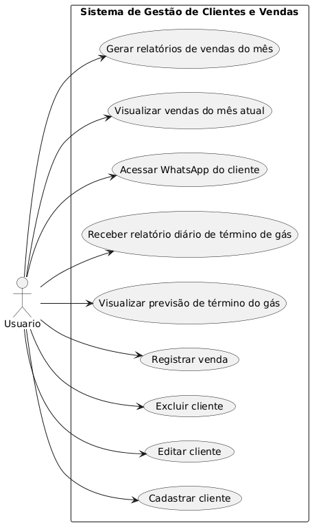

# DgGas

A ideia do sistema surgiu a partir de uma necessidade que observei na empresa do meu pai, que atua no ramo de venda e distribuição de gás. Percebi que muitos processos estavam sendo feitos manualmente, o que tomava tempo, gerava retrabalho e dificultava o controle das informações.

Diante disso, decidi desenvolver um sistema com o objetivo de informatizar e agilizar essas atividades. Com ele, é possível cadastrar e gerenciar clientes, registrar vendas, acompanhar o consumo de gás e prever quando o cliente pode precisar de uma nova recarga. Também incluí a integração com o WhatsApp para facilitar a comunicação, além da geração de relatórios mensais e diários que ajudam a tomar decisões com mais precisão.

Esse projeto me permitiu aplicar na prática os conhecimentos adquiridos na área de desenvolvimento, ao mesmo tempo em que trouxe melhorias reais para o funcionamento da empresa do meu pai.

---
# Historias de usuários

1 - Como usuário, quero poder cadastrar, editar e excluir as informações dos meus clientes, para manter os dados sempre atualizados e organizados.

2 - Como usuário, quero registrar minhas vendas, para que eu possa acompanhar e controlar melhor o desempenho do meu negócio.

3 - Como usuário, quero receber diariamente um relatório com a previsão de término do gás dos clientes, para que eu possa enviar uma mensagem antecipada e oferecer reposição.

4 - Como usuário, quero ter um botão que me leve diretamente para a conversa no WhatsApp do cliente, para facilitar e agilizar a comunicação.

5 - Como usuário, quero acessar informações e relatórios das vendas do mês atual, para acompanhar os resultados em tempo real e tomar decisões mais informadas.

---
# Casos De Uso

---
